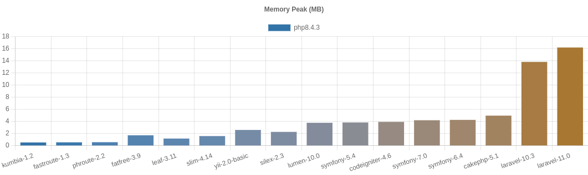

# PHP Frameworks Bench
[](https://github.com/myaaghubi/PHP-Frameworks-Bench/actions/workflows/test.yml)  


This project attempts to measure the minimum overhead (minimum bootstrap cost) of PHP frameworks in the real world.

So I think the minimum should not include:

* cost of template engine
* cost of database manipulation
* cost of debugging information

Benchmarking on components like template engines or ORM/Database libraries is out of the scope of this project.


- [PHP Frameworks Bench](#php-frameworks-bench)
  - [Benchmarks](#benchmarks)
    - [Latest](#latest)
    - [OPCache On/Off](#opcache-on)
  - [How to Benchmark](#how-to-benchmark)
  - [Docker](#docker)
  - [Commands](#commands)
  - [Benchmarking Policy](#benchmarking-policy)
  - [Add Your Framework](#add-your-framework)
  - [Donate](#-donate)
  - [References](#references)
  - [License](#license)


## Benchmarks

### Latest

#### Environment

* Ubuntu 22.04 LTS x86_64
  * PHP 8.2.5
  * OPCache Off
  * Apache 2.4.52
  * WRK 4.2.0 (5 min)
  * CPU Core i7-3770K@4.4Ghz
  * Memory 16G 


#### Results (2023/5/15)

These are my benchmarks, not yours. **I encourage you to run on your -production equivalent- environments.**





|framework          |requests per second (rps)|relative (rps)|peak memory|relative (mem)|
|-------------------|------------------------:|-------------:|----------:|-------------:|
|pure-php           |                27,379.94|         282.4|       0.42|           1.0|
|kumbiaphp-1.1      |                 5,862.48|          60.5|       0.54|           1.3|
|fastroute-1.3      |                 4,591.01|          47.3|       0.56|           1.3|
|phroute-2.2        |                 4,303.07|          44.4|       0.58|           1.4|
|leaf-3.3           |                 1,576.68|          16.3|       1.10|           2.6|
|fatfree-3.8.1      |                 1,512.30|          15.6|       1.67|           4.0|
|slim-4.11          |                   805.51|           8.3|       1.57|           3.7|
|ubiquity-2.4.x.dev |                   726.70|           7.5|       1.64|           3.9|
|silex-2.3          |                   558.07|           5.8|       2.16|           5.1|
|yii-2.0-basic      |                   508.32|           5.2|       2.57|           6.1|
|fuelphp-1.9        |                   450.65|           4.6|       2.51|           6.0|
|lumen-10.0         |                   352.94|           3.6|       3.49|           8.3|
|codeigniter-4.3    |                   324.27|           3.3|       3.50|           8.3|
|symfony-5.4        |                   311.74|           3.2|       3.82|           9.1|
|laminas-2.0        |                   309.30|           3.2|       3.50|           8.3|
|symfony-6.3        |                   290.69|           3.0|       3.91|           9.3|
|cakephp-4.4        |                   262.25|           2.7|       4.49|          10.7|
|laravel-10.0       |                    96.97|           1.0|      11.99|          28.5|


#### OPCache On
Check out the video for more information.
[](http://www.youtube.com/watch?v=Dk8YHQZ6jfY)


## How to Benchmark

If you want to have benchmarks on `PHP extension frameworks` like `Phalcon`, you need to install the extension first, based on its own documentation.

1- Download & Setup:

```bash
# make sure to put it in the root of your web path
$ git clone https://github.com/myaaghubi/PHP-Frameworks-Bench.git

$ cd PHP-Frameworks-Bench

# optional
$ nano benchmark.config

# run the setup & follow the progress
$ yes | bash setup.sh
```

2- Make sure everything is ok:

```bash
$ bash check.sh
# bash check.sh -t pure-php
# ✔ pure-php
```

3- Run benchmarks:

```bash
# bash benchmark.sh --help
$ bash benchmark.sh
```

4- Check the results:
- web:

  <http://127.0.0.1/PHP-Frameworks-Bench/>

- terminal:
  ```bash
  # bash results.sh --help
  bash results.sh
  ```


## Docker

Results with docker may not be reliable but in a situation you can use it like:

1- Change the `base` in `benchmark.config` on the right port(`8080` considered):

```ini
base="http://127.0.0.1:8080/PHP-Frameworks-Bench"
...
```

2- Run/download the docker:

```bash
$ bash docker-apache.sh
```

3- Run the benchmark:

```bash
# run it in another terminal
$ bash benchmark.sh
```


## Commands

```bash
# use bash benchmark.sh --help
$ bash benchmark.sh -f -rapache -t pure-php

# run composer update for frameworks
$ bash update.sh

# to clean them all
# trouble? run it then
# you can use `bash setup.sh` again
$ bash clean.sh

# clear the cache of frameworks
$ bash clear-cache.sh

# show the results table
$ bash results.sh
```

To specify frameworks, put them with `-t ...` after each command:

```bash
# supported for `setup.sh`, `benchmark.sh`, `update.sh`, `clean.sh`, and `clear-cache.sh`
# bash benchmarks.sh --help
$ bash benchmark.sh -t laravel-10.0/ slim-4.11/ ...
...
```


## Add Your Framework
Check out the [Benchmarking Policy](#benchmarking-policy), to get more information watch the video [OPCache On/Off](#opcache-on).


## Benchmarking Policy

* Use `composer` to install frameworks according to their official documentation.
* Use the default configuration.
  * Minimum changes on frameworks to have benchmarks.
  * Don't remove any components/configurations even if there is no use for them.
* Include a `controller` class to get the `Hello World!` for each, based on the default template of each framework for `controllers`.
* Turn off the `debug` mode and set the environment to `production` mode.
* General optimization for the production environment, like `--optimize-autoloader` for the `composer`.

Some frameworks are optimized more than others, so some developers may think using default configuration is not fair. The dept of optimizing a framework depends on the skills/experiences of the developer too, so it's the rabbit hole and nonsense for ranking. Please **note** optimizing for the `Hello World` is not acceptable! Building the fastest `Hello World` application is not the goal of this project. I think the default configuration of frameworks is a good starting point to have a ranking.

If you find something wrong in my code, feel free to send a `PR`. 


## 🍔 Donate
Don't forget to donate if you find it useful ☕ 🍺 🍸 🍔

ETH: 0x0ADd51D6855d2DF11BB5F331A3fa345c67a863b2


## References 
Note: This project is based on
[php-framework-benchmark](https://github.com/kenjis/php-framework-benchmark), thanks to [Kenjis](https://github.com/kenjis). It is very old and abandoned, so I decided to split it from the origin and update it separately.

For frameworks, I considered the official repos:
* [CakePHP](https://github.com/cakephp/cakephp)
* [CodeIgniter](https://github.com/codeigniter4/CodeIgniter4)
* [FastRoute](https://github.com/nikic/FastRoute)
* [FatFree](https://github.com/bcosca/fatfree)
* [FuelPHP](https://github.com/fuelphp/fuelphp)
* [KumbiaPHP](https://github.com/KumbiaPHP/KumbiaPHP)
* [Laminas](https://github.com/laminas)
* [Laravel](https://github.com/laravel/laravel)
* [Leaf](https://github.com/leafsphp/leaf)
* [Lumen](https://github.com/laravel/lumen)
* [PhRoute](https://github.com/mrjgreen/phroute)
* [Silex](https://github.com/silexphp/Silex)
* [Slim](https://github.com/slimphp/Slim)
* [Symfony](https://github.com/symfony/symfony)
* [Ubiquity](https://github.com/phpMv/ubiquity)
* [Yii](https://github.com/yiisoft/yii2)


## License

You are allowed to use this plugin/project under the terms of the GNU General Public License version 2.

Copyright (C) 2023 Mohammad Yaaghubi
