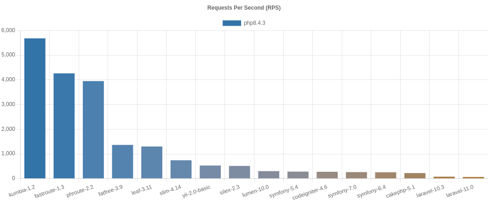
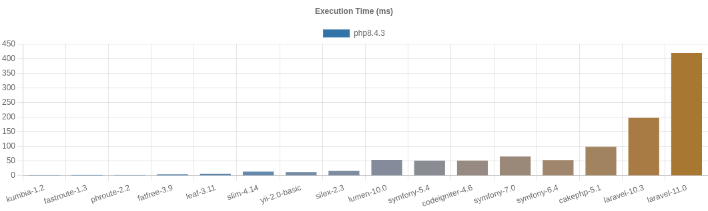

# PHP Frameworks Bench
 

This project attempts to measure the minimum overhead (minimum bootstrap cost) of PHP frameworks in the real world.

So I think the minimum should not include:

* cost of template engine (HTML output)
* cost of database manipulation
* cost of debugging information

Components like Template engines or ORM/Database libraries are out of scope in this project.


- [PHP Frameworks Bench](#php-frameworks-bench)
  - [Benchmarking Policy](#benchmarking-policy)
  - [How to Benchmark](#how-to-benchmark)
  - [Commands](#commands)
  - [Benchmarks](#benchmarks)
    - [Latest](#latest)
    - [OPCache](#results-with-opcache)
  - [References](#references)
  - [License](#license)


## Benchmarking Policy

This is `master` branch.

* Install a framework via `composer` according to the official documentation.
* Use the default configuration.
  * Don't remove any components/configurations even if they are not used.
  * With minimum changes to run this benchmark.
* Set environment production/Turn off debug mode.
* Run the general optimization in your production environment, like `--optimize-autoloader` for the composer.
* Use controller class.

Some frameworks are optimized, some are not, so some people may think using default configuration is not fair. The dept of optimizing a framework depends on the developer's experienced too, so it's the rabbit hole and there is no point in that for benchmarking. I think the default configuration of frameworks is a good starting point to have the ranking points.

If you find something wrong with my code, feel free to send PR. But please note optimizing for the "Hello World" is not acceptable! Building the fastest "Hello World" application is not the goal of this project.


## How to Benchmark

If you want to benchmark PHP extension frameworks like Phalcon, you need to install the extenstions.

1- Download & install the library in your localhost:

```
# instead you can use --branch vx.x
$ git clone https://github.com/myaghobi/php-frameworks-bench.git
$ cd php-frameworks-bench
# run the setup & follow the progress
$ bash setup.sh
```

2- To make sure everything is ok:

```
# this is optional
$ bash check.sh
```

3- Run benchmarks:

```
$ bash benchmark.sh
```

4- Check the resuts:

<http://localhost/php-frameworks-bench/>


## Commands

```
# composer update for each framework
$ bash update.sh

# to clean them all
# trouble? run it then
# you can use setup.sh 
$ bash clean.sh

# clear the cache of frameworks
$ bash clear-cache.sh

# show the table of last benchmark
$ bash show-table.sh
```

To specify the frameworks, put them after each command:

```
$ bash benchmark.sh laravel-9.1/ slim-4.10/ fatfree-3.8.0/
...
```


## Benchmarks

### Latest

#### Environment

* Ubuntu 22.04 LTS 64bit
  * PHP 8.1.5
  * OPCache disabled
  * Apache 2.4.52
  * CPU Core i7 2600K@4Ghz
  * Memory 16G 


#### Results (2022/5/15)

These are my benchmarks, not yours. **I encourage you to run on your (production equivalent) environments.**






|framework          |requests per second|relative|peak memory|relative|
|-------------------|------------------:|-------:|----------:|-------:|
|pure-php           |          22,427.34|22,427.3|       0.42|     0.4|
|fastroute-1.3      |           4,224.76| 4,224.8|       0.56|     0.6|
|phroute-2.2        |           3,901.59| 3,901.6|       0.58|     0.6|
|leaf-3.0           |           1,539.38| 1,539.4|       1.05|     1.1|
|fatfree-3.8.0      |           1,414.71| 1,414.7|       1.67|     1.7|
|siler-1.7.9        |           1,314.15| 1,314.2|       1.17|     1.2|
|frameworkx-dev     |             972.97|   973.0|       1.41|     1.4|
|slim-3.12          |             969.54|   969.5|       1.40|     1.4|
|slim-4.10          |             752.96|   753.0|       1.60|     1.6|
|yii-2.0-basic      |             510.90|   510.9|       2.72|     2.7|
|silex-2.3          |             510.51|   510.5|       2.18|     2.2|
|fuelphp-1.9        |             410.60|   410.6|       2.50|     2.5|
|ubiquity-2.4.x.dev |             379.51|   379.5|       2.33|     2.3|
|lumen-9.0          |             329.70|   329.7|       3.39|     3.4|
|symfony-6.0        |             293.11|   293.1|       3.85|     3.9|
|symfony-5.4        |             291.41|   291.4|       3.77|     3.8|
|codeigniter-4.1    |             290.94|   290.9|       3.39|     3.4|
|laminas-2.0.x.dev  |             284.43|   284.4|       3.52|     3.5|
|cakephp-4.3        |             232.68|   232.7|       4.45|     4.5|
|laravel-9.1        |              93.47|    93.5|      11.04|    11.0|


### Results with OPCache (old version)
[](http://www.youtube.com/watch?v=BUcxalvD92U "PHP OPCache Benchmarks, a Comparison for Popular Frameworks")


## References 
Note: This project is based on
[php-framework-benchmark](https://github.com/kenjis/php-framework-benchmark). It was very old and abandoned, so I decided to split it from the origin and update it separately.

* [CakePHP](https://github.com/cakephp/cakephp)
* [CodeIgniter](https://github.com/codeigniter4/CodeIgniter4)
* [FastRoute](https://github.com/nikic/FastRoute)
* [FatFree](https://github.com/bcosca/fatfree)
* [FrameworkX](https://github.com/clue/framework-x)
* [FuelPHP](https://github.com/fuelphp/fuelphp)
* [Laminas](https://github.com/laminas)
* [Laravel](https://github.com/laravel/laravel)
* [Leaf](https://github.com/leafsphp/leaf)
* [Lumen](https://github.com/laravel/lumen)
* [PhRoute](https://github.com/mrjgreen/phroute)
* [Siler](https://github.com/leocavalcante/siler)
* [Silex](https://github.com/silexphp/Silex)
* [Slim](https://github.com/slimphp/Slim)
* [Symfony](https://github.com/symfony/symfony)
* [Ubiquity](https://github.com/phpMv/ubiquity)
* [Yii](https://github.com/yiisoft/yii2)


## License

You are allowed to use this plugin/project under the terms of the GNU General Public License version 2.

Copyright (C) 2022 Mohammad Yaghobi
