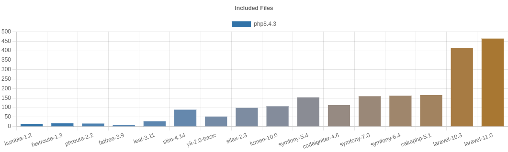

# PHP Frameworks Bench
 

This project attempts to measure the minimum overhead (minimum bootstrap cost) of PHP frameworks in the real world.

So I think the minimum should not include:

* cost of template engine
* cost of database manipulation
* cost of debugging information

Benchmarking on components like template engines or ORM/Database libraries is out of the scope of this project.


- [PHP Frameworks Bench](#php-frameworks-bench)
  - [Benchmarks](#benchmarks)
    - [Latest](#latest)
  - [Benchmarking Policy](#benchmarking-policy)
  - [How to Benchmark](#how-to-benchmark)
  - [Commands](#commands)
  - [Donate](#🍔-donate)
  - [References](#references)
  - [License](#license)


## Benchmarks

### Latest

#### Environment

* Ubuntu 22.04 LTS x86_64
  * PHP 8.2.5
  * OPCache Off
  * Apache 2.4.52
  * WRK 4.2.0
  * CPU Core i7-3770K@4.4Ghz
  * Memory 16G 


#### Results (2023/5/15)

These are my benchmarks, not yours. **I encourage you to run on your (production equivalent) environments.**




|framework          |requests per second (rps)|relative (rps)|peak memory|relative (mem)|
|-------------------|------------------------:|-------------:|----------:|-------------:|
|pure-php           |                27,379.94|      27,379.9|       0.42|           0.4|
|fastroute-1.3      |                 4,591.01|       4,591.0|       0.56|           0.6|
|phroute-2.2        |                 4,303.07|       4,303.1|       0.58|           0.6|
|leaf-3.3           |                 1,576.68|       1,576.7|       1.10|           1.1|
|fatfree-3.8.1      |                 1,512.30|       1,512.3|       1.67|           1.7|
|siler-1.7.9        |                 1,416.80|       1,416.8|       1.17|           1.2|
|slim-3.12          |                 1,061.05|       1,061.1|       1.40|           1.4|
|frameworkx-dev     |                   994.55|         994.6|       1.45|           1.5|
|slim-4.11          |                   805.51|         805.5|       1.57|           1.6|
|ubiquity-2.4.x.dev |                   726.70|         726.7|       1.64|           1.6|
|silex-2.3          |                   558.07|         558.1|       2.16|           2.2|
|yii-2.0-basic      |                   508.32|         508.3|       2.57|           2.6|
|fuelphp-1.9        |                   450.65|         450.7|       2.51|           2.5|
|lumen-10.0         |                   352.94|         352.9|       3.49|           3.5|
|codeigniter-4.3    |                   324.27|         324.3|       3.50|           3.5|
|symfony-5.4        |                   319.55|         319.6|       3.82|           3.8|
|symfony-6.2        |                   314.21|         314.2|       3.89|           3.9|
|laminas-2.0        |                   309.30|         309.3|       3.50|           3.5|
|cakephp-4.4        |                   262.25|         262.3|       4.49|           4.5|
|laravel-10.0       |                    96.97|          97.0|      11.99|          12.0|


## Benchmarking Policy

This is for the `main` branch.

* Frameworks installed via `composer` according to their official documentation.
* Used the default configuration.
  * Considering the minimum changes on frameworks to run the benchmark.
  * Didn't remove any components/configurations even if there is no use for them.
* We have a `controller` class to get the `Hello World` for each, based on the default template of each framework.
* Turned off the `debug` mode and set the environment to `production` mode.
* Considered general optimization for the production environment, like `--optimize-autoloader` for the composer.

Some frameworks are optimized more than others, so some people may think using default configuration is not fair. The dept of optimizing a framework depends on the experiences of the developer too, so it's the rabbit hole and there is no point in it. I think the default configuration of frameworks is a good starting point to get ranking.

If you find something wrong in my code, feel free to send a PR. But please note optimizing for the "Hello World" is not acceptable! Building the fastest `Hello World` application is not the goal of this project.


## How to Benchmark

If you want to have benchmarks on `PHP extension frameworks` like Phalcon, you need to install the extension first based on its own documentation.

1- Download & Setup:

```bash
# ...--branch vx.x
$ git clone https://github.com/myaaghubi/PHP-Frameworks-Bench.git

$ cd PHP-Frameworks-Bench

# run the setup & follow the progress
# check out benchmark.config
# yes | bash setup.sh
$ bash setup.sh
```

2- Make sure everything is ok:

```bash
# this is optional
$ bash check.sh
# bash check.sh -t pure-php
# /------- pure-php: checking... done.
```

3- Run benchmarks:

```bash
$ bash benchmark.sh
```

4- Check the resuts:
- web:

  <http://localhost/PHP-Frameworks-Bench/>

- command:
  ```
  bash show-table.sh
  ```


## Commands

```bash
# run composer update for frameworks
$ bash update.sh

# to clean them all
# trouble? run it then
# you can use `bash setup.sh` again
$ bash clean.sh

# clear the cache of frameworks
$ bash clear-cache.sh

# show the results of the last benchmark
$ bash show-table.sh
```

To specify the frameworks, put them with `-t ...` after each command:

```bash
# supported for `setup.sh`, `benchmark.sh`, `update.sh`, `clean.sh`, and `clear-cache.sh`
# bash benchmarks.sh --help -h
$ bash benchmark.sh -t laravel-10.0/ slim-4.11/ ...
...
```


## 🍔 Donate
Don't forget to donate if you find it useful ☕ 🍺 🍸 🍔

ETH: 0x0ADd51D6855d2DF11BB5F331A3fa345c67a863b2


## References 
Note: This project is based on
[php-framework-benchmark](https://github.com/kenjis/php-framework-benchmark), thanks to [Kenjis](https://github.com/kenjis). It is very old and abandoned, so I decided to split it from the origin and update it separately.

For frameworks, I considered the official repos:
* [CakePHP](https://github.com/cakephp/cakephp)
* [CodeIgniter](https://github.com/codeigniter4/CodeIgniter4)
* [FastRoute](https://github.com/nikic/FastRoute)
* [FatFree](https://github.com/bcosca/fatfree)
* [FrameworkX](https://github.com/clue/framework-x)
* [FuelPHP](https://github.com/fuelphp/fuelphp)
* [Laminas](https://github.com/laminas)
* [Laravel](https://github.com/laravel/laravel)
* [Leaf](https://github.com/leafsphp/leaf)
* [Lumen](https://github.com/laravel/lumen)
* [PhRoute](https://github.com/mrjgreen/phroute)
* [Siler](https://github.com/leocavalcante/siler)
* [Silex](https://github.com/silexphp/Silex)
* [Slim](https://github.com/slimphp/Slim)
* [Symfony](https://github.com/symfony/symfony)
* [Ubiquity](https://github.com/phpMv/ubiquity)
* [Yii](https://github.com/yiisoft/yii2)


## License

You are allowed to use this plugin/project under the terms of the GNU General Public License version 2.

Copyright (C) 2023 Mohammad Yaaghubi
